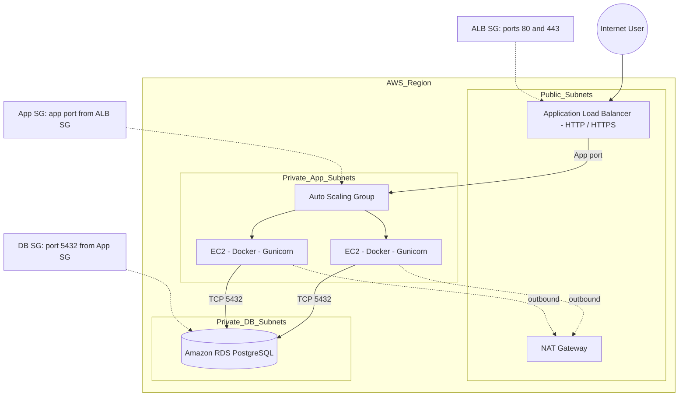

# Three-Tier AWS Architecture


> A portfolio-focused cloud engineering project demonstrating a secure, scalable three-tier web application on AWS using Terraform, Docker, PostgreSQL, and DevSecOps practices.

## Project overview

This project models a production-style web platform with clear network and security boundaries:

- Internet-facing Application Load Balancer in public subnets
- Dockerized Flask application on private EC2 instances
- Auto Scaling across two Availability Zones
- Private PostgreSQL RDS database
- Security-group based tier isolation
- Systems Manager access instead of public SSH
- Terraform-based infrastructure definition
- GitHub Actions validation and security scanning

> **Project status:** application, Docker, Terraform modules, documentation, and CI checks are present. Terraform syntax repair and production credential migration to Secrets Manager remain before AWS deployment.

## Architecture



### Request flow

1. A user connects to the ALB.
2. The ALB routes requests only to healthy private application instances.
3. Gunicorn serves the Flask application inside Docker.
4. The application reads and writes visitor records in private PostgreSQL.
5. Application instances have no public IP addresses.

## Technology stack

| Area | Technologies |
| --- | --- |
| Cloud | AWS VPC, ALB, EC2, ASG, RDS, IAM, SSM |
| Infrastructure | Terraform, modular IaC, configurable variables |
| Application | Python, Flask, psycopg, Gunicorn |
| Runtime | Docker, non-root container user |
| Security | Security groups, private subnets, encrypted RDS, Trivy, Checkov |
| Delivery | GitHub Actions, Terraform validation, test automation |

## Application endpoints

| Endpoint | Purpose |
| --- | --- |
| `GET /` | Application landing page |
| `GET /health` | Load-balancer health check |
| `GET /health/db` | Database connectivity check |
| `GET /api/info` | Safe application metadata |
| `GET /api/visitors` | Retrieve visitor records |
| `POST /api/visitors` | Create a validated visitor record |

## Repository structure

```text
├── app/
│   ├── app.py
│   ├── Dockerfile
│   ├── requirements.txt
│   ├── templates/
│   └── tests/
├── terraform/
│   ├── main.tf
│   ├── variables.tf
│   ├── outputs.tf
│   └── modules/
│       ├── vpc/
│       ├── security-groups/
│       ├── alb/
│       ├── compute/
│       └── rds/
├── .github/workflows/
│   └── security-ci.yml
├── docs/
│   ├── deployment-guide.md
│   └── interview-questions.md
├── SECURITY_REVIEW.md
└── PHASES.md
```

## Run locally

```powershell
cd app
python -m venv .venv
.\.venv\Scripts\Activate.ps1
pip install -r requirements.txt
python -m pytest tests -q
python app.py
```

Open <http://localhost:8080/health>.

To use the database endpoints, set `DATABASE_URL` to a PostgreSQL connection string. Never commit that value.

## Build the container

```powershell
docker build -t three-tier-app:local app
docker run --rm -p 8080:8080 three-tier-app:local
```

The image runs as a non-root user and uses Gunicorn rather than Flask’s development server.

## Terraform workflow

Create a private variables file:

```powershell
Copy-Item terraform/terraform.tfvars.example terraform/terraform.tfvars
```

Then configure AWS credentials and run validation:

```powershell
aws sts get-caller-identity
terraform -chdir=terraform fmt -recursive
terraform -chdir=terraform init -backend=false
terraform -chdir=terraform validate
terraform -chdir=terraform plan -var-file=terraform.tfvars -out=tfplan
```

Review the plan before applying:

```powershell
terraform -chdir=terraform show -no-color tfplan > plan.txt
terraform -chdir=terraform apply tfplan
```

Do not apply infrastructure without reviewing the plan and confirming the expected cost. See the [deployment guide](docs/deployment-guide.md) for permissions, verification, and teardown procedures.

## Security design

- ALB is the only intended public entry point.
- EC2 instances run in private subnets without public IP addresses.
- RDS is private and configured with `publicly_accessible = false`.
- App ingress is allowed only from the ALB security group.
- Database ingress is allowed only from the app security group.
- SSM is used instead of opening SSH to the Internet.
- The Docker image uses a non-root user.
- CI runs Terraform validation, Checkov, Trivy, and Python tests.
- Secrets must not be committed to Git, Docker images, workflows, or Terraform variable files.

### Known hardening work

Before production use, migrate the database password from Terraform/user data to AWS Secrets Manager, restrict IAM permissions further, use an encrypted remote state backend, require HTTPS, and configure final RDS snapshots.

## Cost awareness

This architecture is not guaranteed to be free-tier eligible. Likely charges include:

- Application Load Balancer
- NAT Gateway and data processing
- EC2 and EBS
- RDS instance, storage, and backups
- CloudWatch logs and metrics
- ECR storage and data transfer

Use one NAT Gateway and minimal capacity for development, then destroy resources when finished. Review retained snapshots, logs, images, and state storage separately.

## Interview discussion points

This project demonstrates practical discussion topics including:

- Why public and private subnet boundaries matter
- Security-group references between tiers
- NAT Gateway resilience versus cost
- ALB health checks and ASG instance refresh
- Terraform state and secret exposure risks
- OIDC versus long-lived GitHub credentials
- RDS private connectivity and backup strategy
- Container hardening and vulnerability scanning
- Troubleshooting unhealthy targets and database connectivity

See the full [interview preparation guide](docs/interview-questions.md).

## Documentation

- [AWS deployment guide](docs/deployment-guide.md)
- [DevSecOps review](SECURITY_REVIEW.md)
- [Interview questions and answers](docs/interview-questions.md)
- [Implementation phases](PHASES.md)

## License

This project is available under the MIT License.
